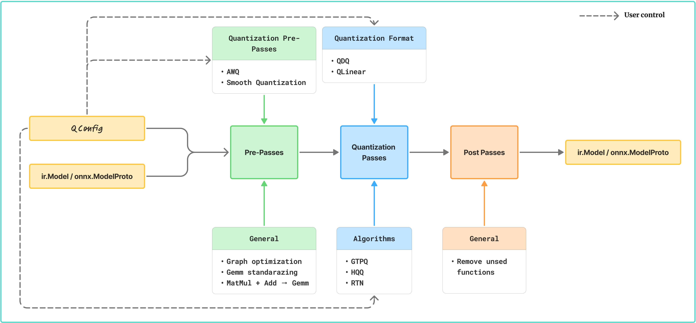

# onnx-quantize

[](https://pypi.org/project/onnx_quantize/)

**ONNX Quantization Framework** built on top of  
- [ONNX IR](https://github.com/onnx/ir-py)  
- [ONNXScript](https://github.com/microsoft/onnxscript)  

> ⚠️ This project is under active development.

---

## 📦 Installation

Install directly from **PyPI**:

```python
pip install onnx-quantize
```

## 🚀 Quick Start

Here's a minimal example to quantize an ONNX model:
```python
from onnx_quantize import QConfig, QuantType, QWeightArgs, QActivationArgs, quantize 
import onnx

# Load your model
model = onnx.load("your_model.onnx")

# Define quantization configuration
qconfig = QConfig(
    weights=QWeightArgs(
        dtype=QuantType.QInt8,
        symmetric=True,
        strategy="tensor",  # or "channel"
    ),
    input_activations=QActivationArgs(
        dtype=QuantType.QInt8,
        symmetric=False,
        is_static=False,  # Dynamic quantization
    ),
)

# Quantize the model
qmodel = quantize(model, qconfig)

# Save the quantized model
onnx.save(qmodel, "qmodel.onnx")
```

## Quantization Flow


## ✨ Features

### Quantization Modes
- **Static Quantization**: Calibration-based quantization with activation statistics
- **Dynamic Quantization**: Runtime quantization for activations
- **Weights-Only Quantization**: Quantize only model weights, keeping activations in FP32
- **Fine-grained Control**: Separate configuration for weights, input activations, and output activations

### Data Types
Supports multiple quantization data types:
- **INT4** / **UINT4**: 4-bit quantization
- **INT8** / **UINT8**: 8-bit quantization (default)

### Quantization Strategies
- **Tensor-wise**: Single scale/zero-point per tensor
- **Per-channel**: Separate scale/zero-point per output channel
- **Group**: Configurable group size for finer-grained quantization

### Algorithms
- **RTN (Round-To-Nearest)**: Default quantization method with MSE optimization support
- **GPTQ**: Advanced weight quantization with Hessian-based error correction

### Quantization Options
- **Symmetric/Asymmetric**: Control zero-point usage
- **Reduce Range**: Use reduced range for better numerical stability for some hardware
- **Clip Ratio**: Percentile-based clipping for outlier handling
- **MSE Optimization**: Minimize mean squared error when computing quantization parameters

### Supported Operations
Currently supports quantization for:
- **MatMul**: Matrix multiplication operations
- **Gemm**: General matrix multiplication


## 📋 Examples

### Weights-Only Quantization (4-bit)
```python
from onnx_quantize import QConfig, QuantType, QWeightArgs, quantize
import onnx

model = onnx.load("model.onnx")

qconfig = QConfig(
    weights=QWeightArgs(
        dtype=QuantType.QUInt4,
        symmetric=True,
        strategy="tensor"
    )
)

qmodel = quantize(model, qconfig)
onnx.save(qmodel, "model_w4.onnx")
```

### Group Quantization
```python
from onnx_quantize import QConfig, QuantType, QWeightArgs, quantize
import onnx

model = onnx.load("model.onnx")

qconfig = QConfig(
    weights=QWeightArgs(
        dtype=QuantType.QInt8,
        symmetric=True,
        group_size=128,
        strategy="group"
    )
)

qmodel = quantize(model, qconfig)
onnx.save(qmodel, "model_group.onnx")
```

### Static Quantization with Calibration
```python
from onnx_quantize import QConfig, QuantType, QWeightArgs, QActivationArgs, quantize
import onnx
import numpy as np

model = onnx.load("model.onnx")

# Prepare calibration data
calibration_data = np.random.randn(100, 224, 224, 3).astype(np.float32)

qconfig = QConfig(
    weights=QWeightArgs(
        dtype=QuantType.QInt8,
        symmetric=True,
        strategy="tensor"
    ),
    input_activations=QActivationArgs(
        dtype=QuantType.QUInt8,
        symmetric=False,
        is_static=True  # Static quantization
    ),
    calibration_data=calibration_data
)

qmodel = quantize(model, qconfig)
onnx.save(qmodel, "model_static.onnx")
```

### Output Activation Quantization
```python
from onnx_quantize import QConfig, QuantType, QWeightArgs, QActivationArgs, quantize
import onnx
import numpy as np

model = onnx.load("model.onnx")

# Prepare calibration data for static quantization
calibration_data = np.random.randn(100, 224, 224, 3).astype(np.float32)

qconfig = QConfig(
    weights=QWeightArgs(
        dtype=QuantType.QInt8,
        symmetric=True,
        strategy="tensor"
    ),
    input_activations=QActivationArgs(
        dtype=QuantType.QUInt8,
        symmetric=False,
        is_static=True
    ),
    output_activations=QActivationArgs(
        dtype=QuantType.QUInt8,
        symmetric=False,
        is_static=True
    ),
    calibration_data=calibration_data
)

qmodel = quantize(model, qconfig)
onnx.save(qmodel, "model_full_quant.onnx")
```

## 🎯 Goals

The goal is to provide a flexible and extensible quantization framework using modern ONNX tooling ([ONNXScript](https://github.com/microsoft/onnxscript) and [ONNX IR](https://github.com/onnx/ir-py)), with capabilities comparable to [Neural Compressor](https://github.com/intel/neural-compressor).
